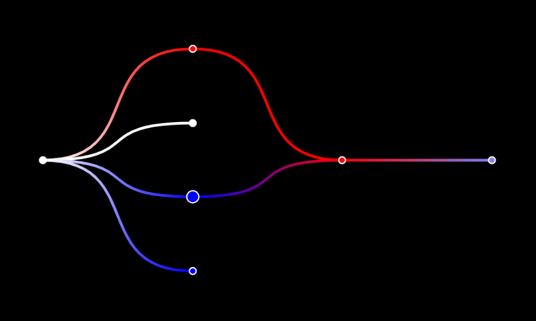

# GraphDrawer.js
GraphDrawer.js is a Library to draw Graphs. The current version however is only drawing tree like graphs reliably. Other graphs may cause unexpected results.

## Installation
Run the following command to install the most recent version of GraphDrawer.js from NPM:
```sh
npm install graph-drawer
```
## Example Code
The following code shows how to draw a Graph with the help of the library `Graphology.js version: "0.25.1"`.
```ts
import  GraphDrawer  from  'graph-drawer'
import  Graphology  from  "graphology"

const  graph = new  Graphology.Graph();

graph.setAttribute("focus", "4")
graph.addNode('1', { value:  0.0 })
graph.addNode('2', { value:  5 })
graph.addNode('3', { value:  0 })
graph.addNode('4', { value: -2.5 })
graph.addNode('5', { value: -5 })
graph.addNode('7', { value:  3 })
graph.addNode('8', { value: -1 })
graph.addEdge('1', '2')
graph.addEdge('1', '5')
graph.addEdge('1', '3')
graph.addEdge('1', '4')
graph.addEdge('4', '7')
graph.addEdge('2', '7')
graph.addEdge('7', '8')

const  options = {}

const  graphMethods = {
	getNodeKeys: (graph) =>  graph.mapNodes((key) =>  key),
	getOutEdgesKeys: (graph, nodeKey) =>  graph.mapOutEdges(nodeKey, (edge) =>  edge),
	getDestNodeKey: (graph, edgeKey) =>  graph.target(edgeKey),
	getNodeValue: (graph, nodeKey) =>  graph.getNodeAttribute(nodeKey, "value"),
	getNodeFocus: (graph, nodeKey) =>  nodeKey === graph.getAttribute('focus') ? true : false
}

const  graphDrawer = new  GraphDrawer(graphMethods, document.body, options)

graphDrawer.drawGraph(graph, ['1'])

```
## Result


## API
### Constructor: GraphDrawer(graphFunctions, container, options, onNodeClick, onNodeHover)

### graphFunctions:
An object that contains all the necessary operation on the graph to draw it. The object has to contain the  following properties with their value set to their corresponding function.\
The code shows an implementation with the graph library `Graphology.js version: "0.25.1"`.

**getNodeKeys:** Returns all node keys of the graph in an array
```js
// Required
getNodeKeys: (graph) =>  graph.mapNodes((key) =>  key)
```
**getOutEdgesKeys:** Returns all  keys of the outgoing edges
```js
// Required
getOutEdgesKeys: (graph, nodeKey) =>  graph.mapOutEdges(nodeKey, (edge) =>  edge)
```
**getDestNodeKey:** Must return the traget node key of a given edge key
```js
// Required
getDestNodeKey: (graph, edgeKey) =>  graph.target(edgeKey)
```
**getNodeValue:** Returns the node value which is used for the colors of the graph
```js
// Optional
getNodeValue: (graph, nodeKey) =>  graph.getNodeAttribute(nodeKey, "value")
```
**getNodeFocus:** Returns the node key which will be marked 
```js
// Optional
getNodeFocus: (graph, nodeKey) =>  nodeKey === graph.getAttribute('focus') ? true : false
```
### container:
An  empty HTML element, the canvas will be attached to this element  
### options:
An object, by passing in an empty object, the default options will be used
```js
// Example empty options
const  graphDrawer = new  GraphDrawer(graphMethods, document.body, {})
// Example options
const  options = {
	width:  1000, 			// width of the canvas
	height:  600, 			// hight of the canvas
	nodeRadius:  5, 		// radius of the nodes
	nodeRadiusHover:  10,		// radius of a node on hover
	nodeRadiusFocus:  10,		// radius of the with focus
	style: {
	backgroundColor:  "black",  	// background color canvas
	edgeColor:  "white",		// default color of an edge
	nodeBorder:  'white',		// border color of a node
	edgeWidth:  5, 			// width of an edge
	nodeColorPositive:  0,		// edge gradient
	nodeColorNegative:  240,	// edge gradient
	maxLightness:  4		// edge gradient 
}
const  graphDrawer = new  GraphDrawer(graphMethods, document.body, options)

```
#### Edge gradient and node color
**nodeColorPositive**: first value of a HSL color\
 **nodeColorNegative**: first value of a HSL color\
  **maxLightness**:	range of node values
  
If a getNodeValue function is supplied in the GraphMethods object, the edge gradient can be used.  Every node will be colorded according to its value.\
The node values should be in following range: [- **maxLightness**, **maxLigthness**].\
Values between 0 and **maxLigthness** will be of color **nodeColorPositive** with a ligthness dependent on the value\
Values between -  **maxLigthness** and 0 will be of color **nodeColorNegative** with a ligthness dependent on the value

### onNodeClick:
Callback that is fired when a node is clicked.

**Callback arguments**

 - nodeKey: Key of the clicked node
```js
//Example
key => console.log(key + " Click"))
```
### onNodeHover:
Callback that is fired when the curser enters a node and when it leaves that node.

**Callback arguments**

 - nodeKey: Key of the clicked node
 ```js
//Example
key => console.log(key + " Hover"))
```
### .drawGraph(graph, rootNodes):
Draws the graph onto the canvas. This method can also used to update the node values, since a redrawing only happens if the structure of the graph has changed.\
**graph**: graph to draw that is compatible with the graphFunction object\
**rootNodes**: An array of node keys which contains one or more elements
